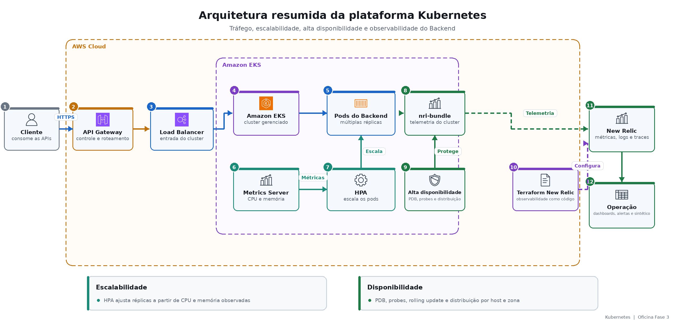

# Oficina Fase 3 — Kubernetes

Documentação da plataforma EKS, da escalabilidade e da observabilidade da Oficina. A visão completa da solução está no [repositório central](https://github.com/tiagomiele/backend).

Projeto de implementação: [fiap-tech-challenge-fase3-oficina-kubernetes-infra](https://github.com/tiagomiele/fiap-tech-challenge-fase3-oficina-kubernetes-infra)

## Visão de negócio

O Kubernetes sustenta a continuidade da operação da oficina. Se a demanda aumentar, a plataforma deve ampliar a capacidade do Backend; se um pod falhar ou precisar ser atualizado, o atendimento deve continuar disponível; se houver degradação, a equipe precisa identificá-la rapidamente.

Esse projeto não implementa regras de clientes ou Ordens de Serviço. Ele oferece a base para que essas funcionalidades operem com escalabilidade, alta disponibilidade, isolamento de rede e visibilidade sobre saúde, consumo e falhas.

## Responsabilidades

- provisionar VPC, sub-redes, rotas, Internet Gateway e NAT Gateway;
- criar Amazon EKS e managed node groups;
- fornecer conectividade e Load Balancer para o Backend;
- instalar Metrics Server e suportar HPA por CPU e memória;
- integrar o cluster ao New Relic por Helm;
- criar dashboards, alertas e monitor sintético como código;
- disponibilizar outputs de rede para Database e Auth;
- separar states e configurações de homologação e produção.

Aplicação Spring Boot, autenticação, schema e RDS permanecem fora deste repositório.

## Arquitetura do componente



## Modelo arquitetural e práticas

O projeto utiliza **Infrastructure as Code declarativa**. Terraform separa rede, cluster, outputs e observabilidade; Helm e arquivos de valores configuram add-ons internos do Kubernetes. Os ambientes possuem workspaces HCP e GitHub Environments independentes.

Clean Architecture descreve a organização do Backend e não se aplica diretamente a um repositório de plataforma. Aqui, as boas práticas são modularidade de infraestrutura, configuração versionada, versões fixadas, plan antes do apply, mínimo privilégio, segredos externos, validação offline e observabilidade como código.

A alta disponibilidade combina múltiplas réplicas, HPA, PodDisruptionBudget, probes, rolling update e distribuição de pods por host e zona.

## Stack e ferramentas

| Área | Tecnologias |
|---|---|
| Nuvem | AWS VPC, Amazon EKS 1.34, node groups e Load Balancer |
| Orquestração | Kubernetes, Helm, Metrics Server, HPA, PDB e probes |
| Infraestrutura | Terraform, HCP Terraform e providers AWS/Kubernetes/Helm |
| Observabilidade | New Relic `nri-bundle`, dashboards, alertas e monitor sintético |
| Automação | GitHub Actions, Bash, Python e PowerShell |
| Qualidade | Terraform Validate, TFLint, yamllint, ShellCheck, actionlint e testes Python |
| Segurança | Trivy, Gitleaks e Secrets externos ao repositório |

## Execução e deploy

Validação local do projeto original:

```bash
terraform fmt -check -recursive
terraform init -backend=false -input=false -lockfile=readonly
terraform validate
python3 -m unittest discover -s tests -p 'test_*.py'
./scripts/lint-cluster-addons.sh
```

Pull Requests executam CI e plans de infraestrutura e observabilidade, sem apply. O merge em `homolog` cria ou atualiza a plataforma de homologação; a promoção para `main` executa produção após o gate do GitHub Environment. Depois do cluster, o workflow sincroniza os outputs de rede, instala add-ons e aplica a observabilidade.

- [Fluxo CI/CD específico](docs/cicd.md)
- [CI/CD integrado da solução](https://github.com/tiagomiele/fiap-tech-challenge-fase3-oficina-backend/blob/documentation/docs/cicd-promocao.md)
- [Bootstrap AWS](https://github.com/tiagomiele/fiap-tech-challenge-fase3-oficina-backend/blob/documentation/docs/bootstrap-aws-do-zero.md)

## Documentação técnica

- [Infraestrutura e observabilidade](docs/infraestrutura-observabilidade.md)
- [ADR de HPA e alta disponibilidade](https://github.com/tiagomiele/fiap-tech-challenge-fase3-oficina-backend/blob/documentation/docs/decisions/adr/0003-alta-disponibilidade-hpa.md)
- [RFC de observabilidade New Relic](https://github.com/tiagomiele/fiap-tech-challenge-fase3-oficina-backend/blob/documentation/docs/decisions/rfc/0004-observabilidade-new-relic.md)
- [Evidência histórica do deploy de produção](https://github.com/tiagomiele/fiap-tech-challenge-fase3-oficina-kubernetes-infra/actions/runs/34524817503)

## Swagger/Postman

Não aplicável: este repositório não publica APIs de negócio. Os contratos e validações funcionais estão no [índice central de APIs e testes](https://github.com/tiagomiele/fiap-tech-challenge-fase3-oficina-backend/blob/documentation/docs/evidencias.md).
