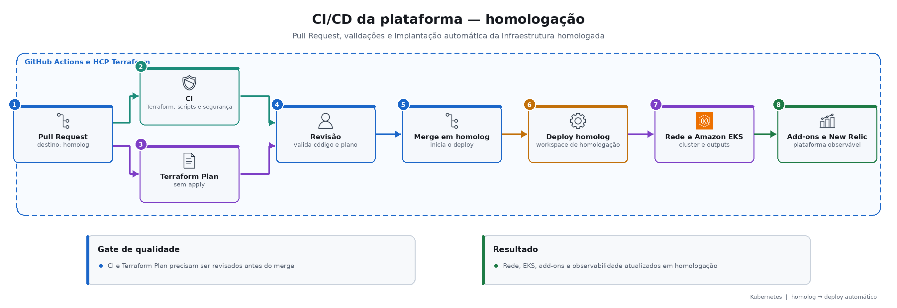
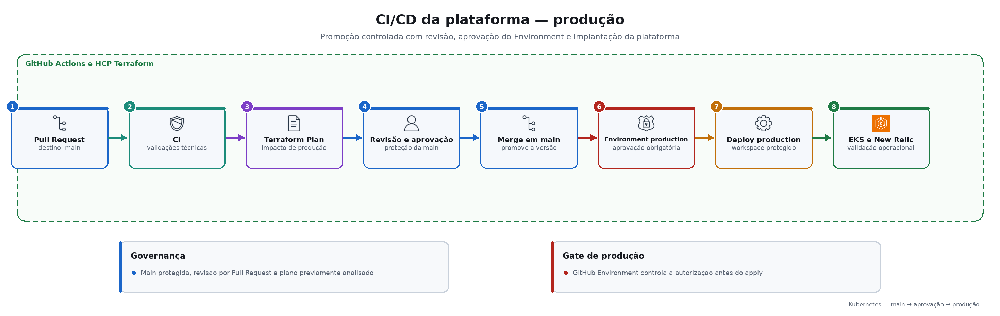

# Fluxos CI/CD

| Workflow | Início | Finalidade |
|---|---|---|
| CI | Push ou PR para `homolog`/`main` | Validar Terraform, scripts, Helm, New Relic e segurança; não aplica infraestrutura. |
| Terraform plan | PR para `homolog`/`main` | Mostrar o que será criado, alterado ou destruído; não executa apply. |
| Deploy homolog | Merge/push em `homolog` ou execução manual | Criar/atualizar rede, EKS, add-ons e observabilidade de homologação. |
| Deploy production | Merge/push em `main` ou execução manual | Aplicar a mesma plataforma no ambiente protegido de produção. |

## Ciclo de homologação

## Ciclo de produção

