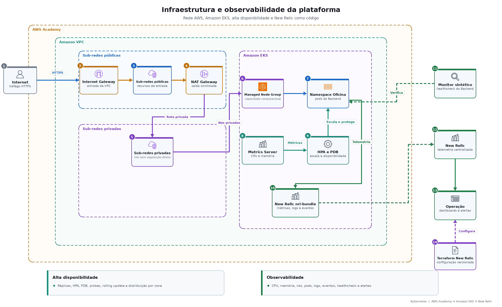

# Infraestrutura e observabilidade

## Alta disponibilidade

- Múltiplas réplicas do Backend.
- HPA por CPU e memória.
- PodDisruptionBudget.
- Probes de startup, liveness e readiness.
- Distribuição por hostname e zona.
- Rolling update sem interrupção planejada.

## Observabilidade

- Métricas de CPU, memória, nós, pods e namespaces.
- Logs estruturados e eventos Kubernetes.
- Dashboards para aplicação, Lambdas, API Gateway e RDS.
- Alertas de saúde e falhas de processamento.
- Monitor sintético para o healthcheck do Backend.

[Evidência do deploy de produção](https://github.com/tiagomiele/fiap-tech-challenge-fase3-oficina-kubernetes-infra/actions/runs/34524817503)

[Dashboard New Relic](https://one.newrelic.com/redirect/entity/ODM5MzU2NHxWSVp8REFTSEJPQVJEfGRhOjEzMTYxOTMx)
